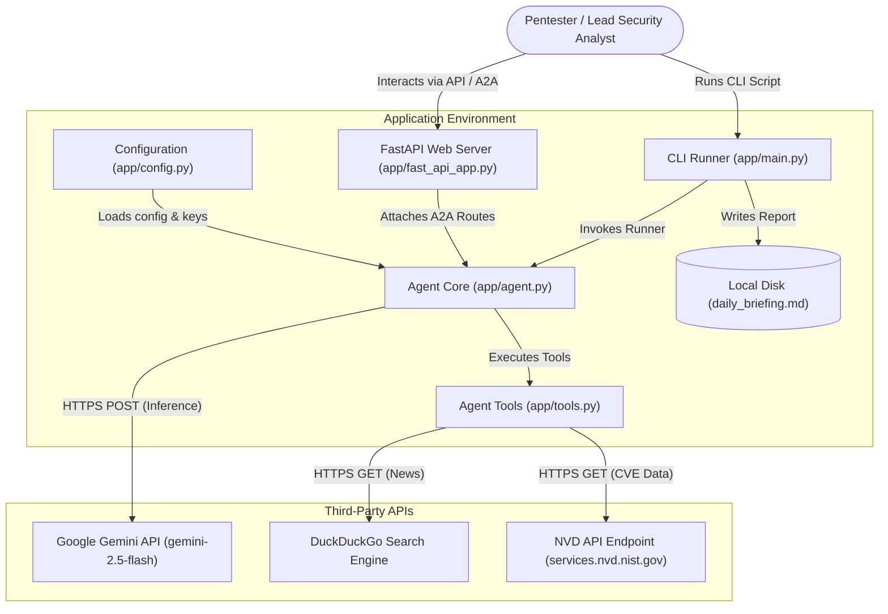

# Daily Security Briefing Agent
## Automating Daily Threat Intelligence and Pentesting Takeaways using Google's ADK 2.0 and Antigravity IDE

---

## 1. Executive Summary & Project Overview
Staying ahead of threats is crucial in cybersecurity. For penetration testing (pentest) teams, understanding the latest vulnerabilities (CVEs) and security news is a daily requirement. However, manually searching the National Vulnerability Database (NVD) and general tech news is tedious and filled with noise.

The **Daily Security Briefing Agent** is an autonomous AI agent built using Google's **Agent Development Kit (ADK 2.0)**. It aggregates, filters, and analyzes recent CVEs and security news, generating a highly structured daily briefing tailored specifically for penetration testing teams. By prioritizing critical and high-severity vulnerabilities (CVSS >= 7.0) related to web, API, and mobile applications, the agent translates raw data into actionable exploits and test-cases.

### Key Capabilities
- **Automated Recent CVE Tracking**: Queries the NVD REST API for vulnerabilities using target keywords (e.g., *Android, iOS, JWT, OAuth, SSRF*).
- **Security News Aggregation**: Utilizes DuckDuckGo Search to aggregate real-world threat updates and active exploitation news.
- **PT-Focused Content Filtering**: Auto-filters results to only highlight CVSS >= 7.0 threats and outlines exploit vectors.
- **Clickable Grounding Links**: Embeds direct reference links to source articles and official NVD advisory pages, preventing hallucination.
- **Agent-to-Agent (A2A) Compatibility**: Fully complies with the A2A Protocol, allowing integration into larger multi-agent orchestration systems.

---

## 2. Problem Statement
Security teams face two main challenges with threat intelligence:
1. **Information Overload**: Security news is noisy, frequently covering business-centric updates rather than technical exploitation details.
2. **API Rate-Limiting & Scraping Issues**: The NVD API heavily rate-limits public requests, and search engine scrapers often face blocking.

Without automation, a lead pentester spends up to an hour every morning scanning feeds, filtering out low-impact CVEs, and writing action items for their team. The Daily Security Briefing Agent solves this by completing the process in seconds, providing clear, structured markdown output ready for team distribution.

---

## 3. Solution Design & Architecture
The system consists of a core ADK agent, custom aggregation tools, a CLI runner for local script execution, and a FastAPI server that exposes reasoning engine endpoints.

### Data Flow & Architecture Diagram
The diagram below illustrates the system boundaries, data flows, and integrations:



---

## 4. Technical Implementation

The project implementation is organized in a modular structure:

### A. Core Agent: `app/agent.py`
The agent is defined using the ADK `Agent` class and binds the custom tools. It utilizes `gemini-2.5-flash` to process aggregation data and structure the final report:
```python
from google.adk.agents import Agent
from google.adk.apps import App
from google.genai import types
from app.config import AGENT_INSTRUCTIONS, GEMINI_MODEL
from app.tools import fetch_recent_cves, search_security_news

root_agent = Agent(
    name="security_briefing_agent",
    model=GEMINI_MODEL,
    description="An agent that gathers today's security news and CVEs to compile a penetration testing daily briefing.",
    instruction=AGENT_INSTRUCTIONS,
    tools=[search_security_news, fetch_recent_cves],
    generate_content_config=types.GenerateContentConfig(
        http_options=types.HttpOptions(
            retry_options=types.HttpRetryOptions(
                attempts=5,
                initial_delay=2.0,
                max_delay=60.0,
                exp_base=2.0,
                jitter=0.3,
                http_status_codes=[429, 500, 502, 503, 504]
            )
        )
    ),
)
app = App(root_agent=root_agent, name="app")
```

### B. Custom Tools: `app/tools.py`
The agent leverages two primary custom Python tools:
1. `search_security_news(topic: str, max_results: int)`: Queries DuckDuckGo for live vulnerability writeups and updates.
2. `fetch_recent_cves(keyword: str, limit: int)`: Queries the NVD REST API. If no API key is configured, it respects the NVD rate limits by introducing defensive delays (`time.sleep(2.0)`) and parses CVSS scoring versions dynamically (checking `v3.1`, `v3.0`, and `v2` metrics).

### C. Prompt Engineering and Structuring: `app/config.py`
The agent's personality and instructions are explicitly defined in `AGENT_INSTRUCTIONS`. This forces the model to filter out CVEs with CVSS scores less than 7.0 and structure the output into a precise markdown report containing:
1. **Critical & High CVEs** (rendered as a markdown table with clickable NVD links).
2. **Mobile Security** (Android/iOS summaries with source citations).
3. **Web & API Security** (JWT/OAuth vulnerability summaries).
4. **AI/LLM Security** (prompt injection and defense updates).
5. **Today's Action Items** (3-5 concrete test cases).

---

## 5. Integration of Key Course Concepts

The project successfully applies several key concepts covered during the *5-Day AI Agents course*:

### 1. Graph-based Agent Architectures (ADK 2.0)
The agent is designed using Google's **Agent Development Kit (ADK)**. By separating logic into declarative configuration, tool registration, and execution runners, the system maintains a clean decoupling between model inference and runtime execution. 

### 2. Antigravity IDE and AI-Agentic Workflow
Development was co-authored using the **Antigravity IDE** and CLI, operating under a prototype-first mindset. A `GEMINI.md` ruleset file configured project-level instructions, enabling the IDE to assist in writing lint-free Python, managing dependency locks via `uv`, and managing the development workflow.

### 3. Systematic Evaluation Loop (The Quality Flywheel)
To guarantee output quality and prevent hallucinations, an evaluation loop was set up under `tests/eval/`. 
- **Evaluation Dataset (`basic-dataset.json`)**: Contains targeted prompts to test response formatting, tool behavior, and edge cases.
- **Custom LLM-as-a-Judge (`metrics.py`)**: Uses the `google-genai` SDK to grade the final response on a 1-5 scale against ground-truth references for accuracy, relevance, and clarity.
- **Command execution**: Rerunning `agents-cli eval generate` and `agents-cli eval grade` during implementation verified the agent consistently formatted links correctly and kept reports focused.

### 4. STRIDE Threat Model & Agent Security
Security was a top-tier design concern. A STRIDE analysis was conducted (`docs/stride_threat_model.md`), identifying threats such as:
- **Tampering (Indirect Prompt Injection)**: Attackers injecting malicious prompts in external CVE descriptions or news articles to bypass filters. Evaluated mitigations include strict system instructions framing tool outputs as untrusted data.
- **Information Disclosure**: Environment isolation of API keys in `.env` (git-ignored) and credentials handling.
- **Denial of Service**: Graceful rate-limiting and timeouts implemented for external HTTP calls to NVD.

---

## 6. Project Verification & Sample Output
Executing the CLI runner (`uv run python app/main.py`) generates a live markdown report. Below is an excerpt of a successfully generated report:

```markdown
## Daily Security Briefing: Penetration Testing Focus

### Critical & High CVEs

| CVE ID | Keyword | CVSS Score | Severity | Pentest Relevance/Impact |
| :------- | :-------- | :--------- | :------- | :----------------------- |
| [CVE-2026-50160](https://nvd.nist.gov/vuln/detail/CVE-2026-50160) | JWT | 10.0 | CRITICAL | **Mass Assignment / Authentication Bypass / RCE:** Unauthenticated attackers can overwrite `JWT_SECRET` via mass assignment, leading to JWT forgery for any user and full server compromise. |
| [CVE-2026-14336](https://nvd.nist.gov/vuln/detail/CVE-2026-14336) | JWT | 8.2 | HIGH | **OIDC Issuer Bypass / JWT Forgery / SSRF:** Weak prefix checks enable attackers to craft malicious issuers (e.g., `https://ci.eclipse.org@evil.host`) to perform SSRF and accept attacker-signed JWTs. |
| [CVE-2026-28699](https://nvd.nist.gov/vuln/detail/CVE-2026-28699) | OAuth | 8.1 | HIGH | **OAuth2 Scope Bypass:** Scope enforcement bypassed via HTTP Basic authentication, leading to unauthorized access. |

### Mobile Security (Android/iOS)
Recent news highlights critical zero-day vulnerabilities actively exploited in both Android and iOS ecosystems. Android devices have seen multiple 0-day exploits, with Google and CISA releasing emergency patches to address high-severity sandbox escapes. [[Android 0-Day Vulnerability Exploited...](https://cybersecuritynews.com/android-0-day-vulnerability-exploited-device/)]

...
```

---

## 7. Public Codebase, Demo, and Deployment
- **GitHub Repository**: `https://github.com/tina1216/security-briefing-agent.git`
- **Video Demonstration**: `[INSERT_YOUR_DEMO_VIDEO_URL_HERE]`
- **FastAPI / A2A Live Endpoint**: `http://localhost:8080/dev-ui/?app=app` (accessible locally via `agents-cli playground`)

---

## 8. Conclusion & Future Work
The Daily Security Briefing Agent successfully automates a key cybersecurity workflow. It proves that combining Google's ADK with structured prompting, robust evaluations, and a security-focused threat model results in a reliable tool that delivers immediate business value. 

Future extensions will focus on:
1. **Multi-Agent Orchestration**: Introducing a sub-agent specifically designed to write proof-of-concept (PoC) exploit code for the identified high-severity CVEs.
2. **Persistence & Caching**: Integrating a Memory Bank or Redis caching database to store previously queried CVEs, improving execution speed and reducing external API load.
